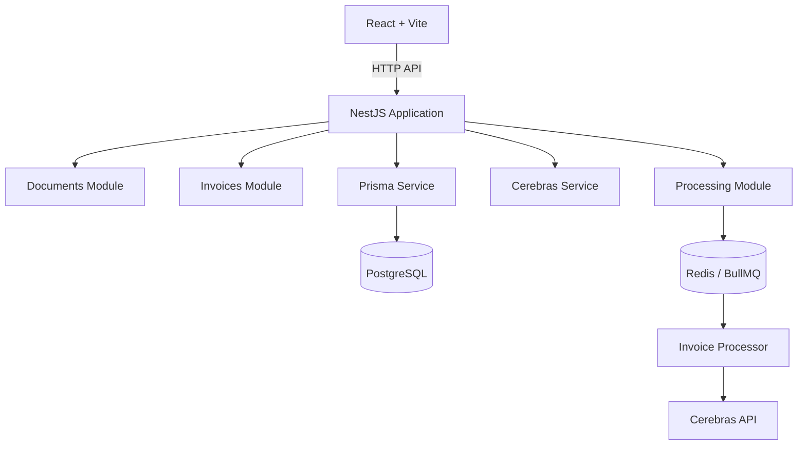
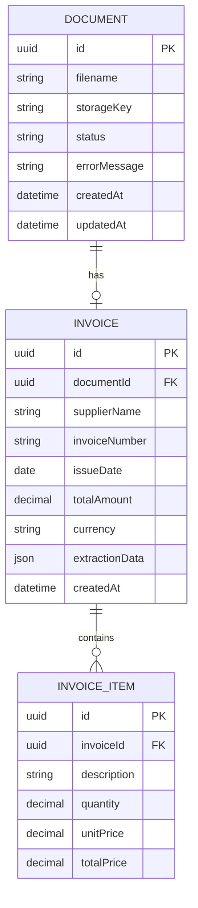

# AI Invoice Processing SaaS — Claude Code Implementation Plan

## This plan is designed for Claude Code to build your MVP step by step, using Cerebras as the LLM provider, without unnecessary overengineering.

### Backend
- NestJS + TypeScript + Prisma
### Frontend
- React + Vite + Tailwind CSS
### Infrastructure
- PostgreSQL + Redis + BullMQ
### AI
- Cerebras API + structured invoice extraction

1. Product scope
Build a web application that allows users to upload invoices in PDF format and automatically extract structured information.

## MVP functionality
- Upload PDF invoices.
- Process invoices asynchronously.
- Extract supplier, invoice number, date, totals, and items.
- Save extracted information in PostgreSQL.
- Display processing status.
- View extracted invoice details.
- Handle processing errors.
- Provide a simple dashboard.

### Avoid in version 1:
- Microservices.
- Multi-tenancy.
- Complex authentication.
- Event sourcing.
- Full DDD architecture.
- Separate frontend/backend monorepo.
- Advanced observability.
- Multiple AI providers from the beginning.
- Overengeneering

2. Architecture
Use a modular monolith with a worker running inside the NestJS application.



The processor can run in the same application initially. You can separate it later if the workload requires it.

3. Step-by-step execution plan
Use each phase as a separate Claude Code session or task. Do not ask Claude Code to build the entire application in one prompt.


## Phase 1 — Initialize the project

### Goal
Create the backend and frontend foundations.

### Tasks
- Create NestJS backend.
- Create React + Vite frontend.
- Configure TypeScript.
- Configure ESLint and formatting.
- Create Docker Compose for PostgreSQL and Redis.
- Configure environment variables.
- Add a basic health-check endpoint.
- Add a basic frontend page.

## Phase 2 — Database and Prisma
### Goal
- Create the database models for documents and invoices.

### Data model



### Status values
- PENDING
- PROCESSING
- COMPLETED
- FAILED

## Phase 3 — Document upload
### Goal
- Allow the user to upload PDF files and save them locally.

### API
| Method | Endpoint | Purpose |
|--------|----------|---------|
| POST | `/documents/upload` | Upload invoice PDF |
| GET | `/documents` | List documents |
| GET | `/documents/:id` | Get document status |

### Upload rules
- Accept PDF only.
- Limit file size.
- Generate a unique storage key.
- Do not trust the original filename.
- Save the document with PENDING status.
- Add a job to BullMQ.

## Phase 4 — BullMQ processing
### Goal
- Create asynchronous invoice processing.

### Processing lifecycle
PENDING
   ↓
PROCESSING
   ↓
COMPLETED

On error:
PROCESSING
   ↓
FAILED

## Phase 5 — PDF text extraction
### Goal

Extract readable text from PDF invoices.

Important distinction

There are two invoice types:

Text-based PDF: Text can be extracted directly.

Scanned PDF: Requires OCR or vision-based processing.

Start with text-based PDFs. Support scanned invoices in a later phase.

## Phase 6 — Cerebras integration
This is the main AI implementation phase.

### Recommended approach
Create an abstraction for invoice extraction, but only one implementation initially:

InvoiceExtractor
      │
      ▼
CerebrasInvoiceExtractor

You do not need to implement OpenAI fallback yet.

AI output
Use a predictable JSON structure:

```json
{
  "supplierName": "Example Supplier Ltd.",
  "invoiceNumber": "INV-1001",
  "issueDate": "2026-09-16",
  "totalAmount": 1250.5,
  "currency": "BRL",
  "items": [
    {
      "description": "Product A",
      "quantity": 2,
      "unitPrice": 100,
      "totalPrice": 200
    }
  ]
}
```

### Validation rules
- Use Zod to validate:
- Required and optional fields.
- ISO date format.
- Numeric values.
- Currency format.
- Item structure.
- Reasonable limits on text lengths.
- Do not assume that the LLM always returns valid JSON.


## Phase 7 — Save extracted invoices
### Goal
- Connect Cerebras extraction to the database.

### Processing workflow
Read document
    ↓
Extract PDF text
    ↓
Call Cerebras
    ↓
Validate with Zod
    ↓
Save Invoice + Items
    ↓
Set Document = COMPLETED


## Phase 8 — Backend API
### Goal
- Expose invoice information to the frontend.

### Endpoints
| Method | Endpoint | Description |
|--------|----------|-------------|
| GET | `/invoices` | List extracted invoices |
| GET | `/invoices/:id` | Invoice details |
| GET | `/documents` | Processing history |
| GET | `/documents/:id` | Processing status |


## Phase 9 — React dashboard
### Goal
- Create a simple, professional interface for the portfolio.

### Pages

#### Dashboard
- Upload invoices and view processing history.

### Invoice details
- View extracted supplier, totals, dates, and line items.

### Dashboard components
- Upload dropzone.
- Invoice table.
- Status badges.
- Processing indicator.
- Error state.
- Refresh or polling mechanism.
- Empty state.

## Phase 10 — Testing and reliability
### Minimum test coverage
- PDF validation and extraction
- Zod invoice schema
- Cerebras response handling
- Successful BullMQ processing
- Failed processing and retries
- Upload endpoint
- Invoice API endpoints

## Phase 11 — Security and production preparation
Before deployment, ask Claude Code to review:
- File upload restrictions.
- Path traversal risks.
- API key protection.
- Rate limiting.
- Request validation.
- Error messages.
- File cleanup.
- Sensitive invoice data exposure.
- CORS.
- Database credentials.
- Dependency vulnerabilities.

## Phase 12 — Deployment and portfolio polish
### Deployment checklist
- [ ] Production PostgreSQL
- [ ] Production Redis
- [ ] Environment variables configured
- [ ] Backend deployed
- [ ] Frontend deployed
- [ ] Database migrations executed
- [ ] Upload storage strategy defined
- [ ] Cerebras API configured
- [ ] README completed
- [ ] Architecture diagram
- [ ] Demo screenshots
- [ ] Test results documented

Important: Local filesystem storage is acceptable for the initial MVP, but production deployments may use ephemeral storage. Plan for object storage such as S3-compatible storage if you need persistent uploaded PDFs.


10. Recommended execution order

Use this order to keep Claude Code focused:
#### Foundation
- CLAUDE.md, NestJS, React, Docker.

#### Database
- Prisma schema and migrations.

#### Upload
- PDF validation, local storage, documents API.

#### Queue
- BullMQ and processing lifecycle.

#### Extraction
- PDF text extraction.

#### Cerebras
- Provider integration, structured output, Zod.

#### Persistence
- Save validated invoices and items.

#### Frontend
- Dashboard and invoice details.

#### Quality
- Tests, security review, README, deployment.

## Final recommendation
Build a complete, functioning MVP before adding advanced features. Your portfolio value will come from demonstrating that you can integrate an LLM, design a reliable asynchronous workflow, validate AI results, and deliver a usable product—not from the number of architectural layers.