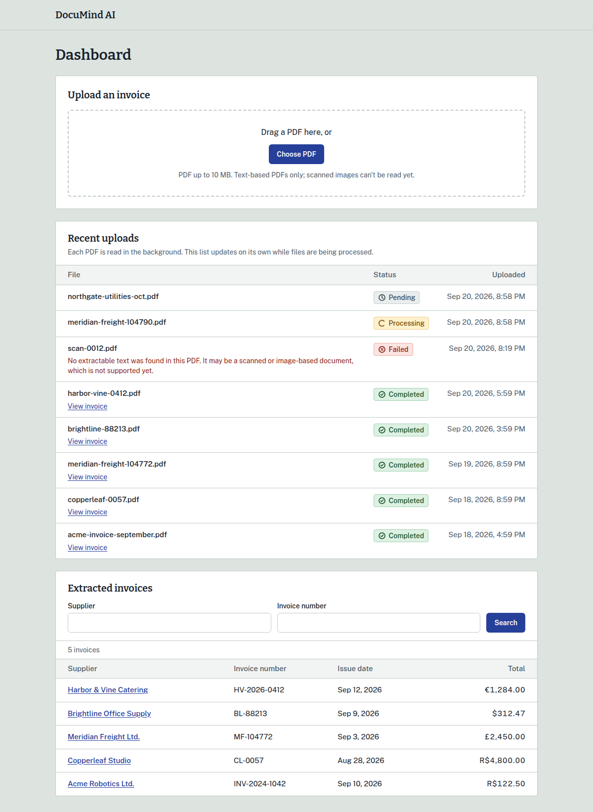
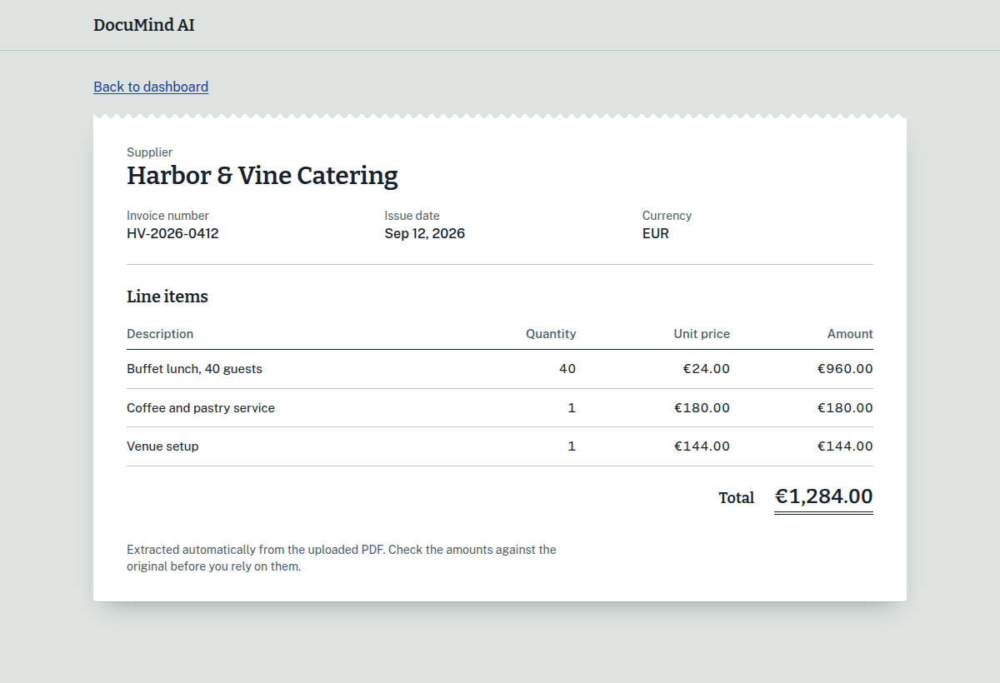
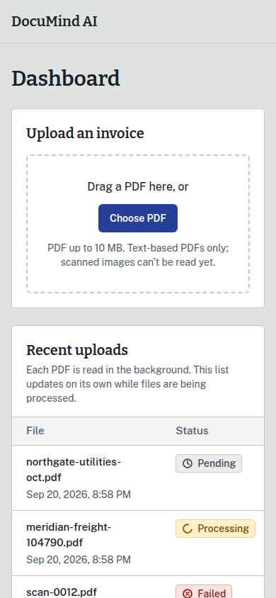
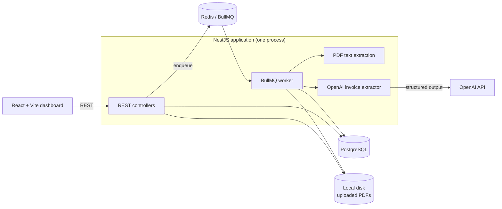

# DocuMind AI

Upload invoice PDFs and get the structured data back: supplier, invoice number, date, currency, total, and every line item. A background pipeline reads the PDF, asks an LLM ([OpenAI](https://openai.com/)) to extract the fields, **validates the answer** before trusting it, and saves it to PostgreSQL. A React dashboard shows what was uploaded, how far along it is, and what was extracted.



<table>
  <tr>
    <td width="66%"></td>
    <td width="34%"></td>
  </tr>
</table>

## What it does

- Accepts **text-based PDF invoices** (up to 10 MB), checking the actual file content rather than trusting the name or declared type.
- Processes them **asynchronously** with a BullMQ queue and worker, with automatic retries for transient failures and no retry for hopeless ones (a scanned PDF, a rejected API key).
- Extracts invoices with OpenAI using **strict structured output**, then **re-validates every field with Zod**. Model output is never trusted as-is.
- Saves the invoice and its line items in **one transaction**; processing the same document twice can never create two invoices.
- Serves a documented REST API with pagination and filters, and a responsive dashboard with live status updates, search, and an invoice details page.
- Shows failures plainly: a failed upload says why, in words meant for the person uploading.

Built as a **modular monolith**: one NestJS process runs both the API and the worker. See [docs/architecture.md](docs/architecture.md).



## Tech stack

| Area | Tools |
|---|---|
| Backend | TypeScript, NestJS 12, Prisma 7 (PostgreSQL 16), BullMQ 6 (Redis 7), Zod 4 |
| PDF and AI | [unpdf](https://github.com/unjs/unpdf) for text extraction, the official OpenAI SDK |
| Frontend | React 19, Vite 8, Tailwind CSS 4, React Router |
| Quality | Vitest, Testing Library, oxlint, TypeScript strict mode |
| Tooling | Docker (local Postgres and Redis, backend image), npm |

## Getting started

**You need:** Node.js 24 (developed on 24.18), Docker with Compose, and an OpenAI API key.

```bash
# 1. Postgres and Redis (bound to localhost only)
cp .env.example .env
docker compose up -d

# 2. Backend
cd backend
cp .env.example .env          # then put your OpenAI key in OPENAI_API_KEY
npm install                   # needs backend/.env to exist first: it runs `prisma generate`
npm run prisma:deploy         # create the tables
npm run start:dev             # http://localhost:3000

# 3. Frontend (in another terminal)
cd frontend
cp .env.example .env
npm install
npm run dev                   # http://localhost:5173
```

Open <http://localhost:5173> and upload a PDF. `backend/test/fixtures/pdf/text-invoice.pdf` is a small synthetic text invoice you can use.

> **No real API key?** The app still runs, but OpenAI will reject the placeholder key, so every upload ends as **Failed** with "The extraction provider rejected the request credentials." Everything before the AI call (upload, validation, PDF reading) works. The test suite never needs a key.

Interactive API docs are at <http://localhost:3000/docs> in development.

## Configuration

Backend, in `backend/.env` (see `backend/.env.example`). Never commit real values; `.env` is git-ignored.

| Variable | Required | Default | Purpose |
|---|---|---|---|
| `DATABASE_URL` | yes | none | PostgreSQL connection string |
| `OPENAI_API_KEY` | yes | none | OpenAI API key. Read only from the environment, never logged |
| `REDIS_URL` | no | `redis://localhost:6379` | Redis for the job queue |
| `PORT` | no | `3000` | HTTP port |
| `CORS_ORIGIN` | in production | `http://localhost:5173` | The one origin allowed to call the API |
| `UPLOAD_DIR` | no | `uploads` | Where uploaded PDFs are stored (`/data/uploads` in the Docker image) |
| `NODE_ENV` | no | unset | `production` turns on startup checks and turns Swagger off |
| `THROTTLE_LIMIT` | no | `300` | Requests per IP, per route, per window |
| `UPLOAD_RATE_LIMIT` | no | `10` | Uploads per IP per window (each one is a paid AI call) |
| `THROTTLE_TTL_MS` | no | `60000` | The rate-limit window |
| `TRUST_PROXY` | no | unset | Number of reverse proxies in front of the app |
| `ENABLE_SWAGGER` | no | on outside production | Force `/docs` on or off |
| `OPENAI_BASE_URL` | no | OpenAI default | Override read by the SDK. The tests point it at a dead port to guarantee no real call |

Frontend, in `frontend/.env`: `VITE_API_URL` (default `http://localhost:3000`) is the API address, fixed at build time.

Local infrastructure, in the root `.env`, used by `docker-compose.yml`: `POSTGRES_USER`, `POSTGRES_PASSWORD`, `POSTGRES_DB`, `POSTGRES_PORT`, `REDIS_PORT`. These are development defaults only.

With `NODE_ENV=production` the backend refuses to start if the API key is a placeholder, the database password is a default one, or `CORS_ORIGIN` is missing.

## How OpenAI is used

OpenAI does one job here: turn the **text of one invoice** into structured fields.

- **Model and SDK:** `gpt-4o-mini`, through the official `openai` npm package.
- **Request:** a system prompt plus the extracted text, at temperature 0, with `response_format` set to a **strict JSON schema** so the model returns exactly the expected fields. Requests time out after 30 s, and the SDK retries transient errors twice.
- **Validation:** whatever comes back is parsed and checked again with Zod: required fields, ISO date, ISO currency code, non-negative numbers, 1 to 200 line items, and upper bounds that match the database columns. Invalid JSON, or data that fails the schema, is a failed extraction and never reaches the database.
- **What is sent:** only the invoice's text, capped at 20,000 characters, from PDFs of at most 50 pages. The PDF file, its name, and other documents are not sent. **Invoice text does leave your infrastructure**, so consider that before using real invoices.
- **Failures** become one typed error (`TIMEOUT`, `RATE_LIMITED`, `AUTH_ERROR`, `PROVIDER_ERROR`, `INVALID_RESPONSE`). Only a rejected key is treated as permanent; the rest are retried by the queue.
- **Logging:** the API key, the invoice text, and the model's output are never logged (a test enforces it).
- **Cost:** one call per uploaded document, more if a transient failure triggers a retry.
- **Isolation:** the rest of the code depends on an `InvoiceExtractor` interface, so tests replace it with a fake and there is no network access in the suite.

## API

| Method | Path | Purpose |
|---|---|---|
| `POST` | `/documents/upload` | Upload a PDF (multipart field `file`) |
| `GET` | `/documents` | List uploads with their status |
| `GET` | `/documents/:id` | One upload |
| `GET` | `/invoices` | List invoices (`page`, `pageSize`, `supplierName`, `invoiceNumber`) |
| `GET` | `/invoices/:id` | One invoice with its line items |
| `GET` | `/health` | Liveness check |

Full reference with request and response examples and every error: **[docs/api.md](docs/api.md)**.

## Testing and quality checks

```bash
# Backend
cd backend
npm run lint          # oxlint, type-aware
npx tsc --noEmit      # type check
npm test              # unit tests, no infrastructure needed
npm run test:e2e      # integration + end-to-end, needs `docker compose up -d`
npm run test:all      # both together
npm run test:cov      # both, with coverage

# Frontend
cd frontend
npm run lint
npm run build         # type checks (tsc -b), then builds
npm test              # component and unit tests (jsdom)
```

What the backend suite covers: validation schemas, error mapping, storage safety, the upload and invoice endpoints over real HTTP, security behavior (headers, CORS, rate limits), and the whole pipeline through the real queue, worker, PDF parser, and database, with only the AI faked. It includes failed extractions, database errors and rollbacks, retries, and duplicate processing.

The suite is hermetic: the OpenAI client is pointed at a dead local port with a dummy key, tests use Redis database 1 and a throwaway uploads directory, and they only touch database rows they create. They do share your development Postgres database. End-to-end files run one at a time because they share a database and a queue.

There is no CI configuration in this repository; run the checks above before merging.

## Deployment

A `backend/Dockerfile` builds a production image; the frontend builds to static files. Postgres, Redis, and persistent disk for uploads are the only other requirements. Steps, environment, and a checklist are in **[docs/deployment.md](docs/deployment.md)**.

## Project structure

```
backend/
  prisma/               schema and migrations
  src/
    documents/          upload + document endpoints
    invoices/           invoice endpoints
    processing/         the BullMQ worker
    pdf/                PDF text extraction
    invoice-extraction/ InvoiceExtractor interface, Zod schema, OpenAI implementation
    storage/            the only code that touches uploaded files
    common/ config/     shared pipes/filters, environment validation
  test/                 end-to-end specs and PDF fixtures
frontend/
  src/
    api/                small typed client (fetch, XHR for upload progress)
    pages/ components/  dashboard and invoice details
    hooks/ lib/         data hook, formatting
docs/                   architecture, API, deployment, screenshots
docker-compose.yml      local Postgres + Redis
```

## Limitations

This is an MVP, and these are real:

- **No authentication or user accounts.** Anyone who can reach the API can upload invoices and read every extracted invoice. It must not be exposed to the public internet as it is.
- **Text-based PDFs only.** There is **no OCR**: scanned or photographed invoices fail with a clear message. PDFs over 50 pages are rejected, and text beyond 20,000 characters is cut before it is sent to the model.
- **Extraction accuracy is not measured.** There is no evaluation set. A model can misread a document, and the invoice total is stored as stated, not cross-checked against the line items. The UI tells users to verify amounts against the original.
- **Files are stored on local disk.** That needs a persistent volume, ties the backend to one instance (or a shared volume), and nothing deletes old files. There is no virus scanning.
- **Documents can't be edited, deleted, re-processed, or exported.** A failed upload has to be uploaded again.
- **Some valid invoices are rejected.** Credit notes (negative amounts) and zero quantities fail validation, and an invoice has a single currency.
- **Stuck jobs are not reconciled.** If Redis loses a job or the worker dies mid-way, a document can stay Pending or Processing.
- **Rate limits are per instance**, held in memory.
- **One AI provider.** The interface allows another, but only OpenAI is implemented.
- **`GET /documents` returns the latest 100 uploads** with no pagination.
- **Testing gaps:** no browser-level end-to-end tests are in the repo (the UI has component tests, and was checked by hand in a browser, including with an automated accessibility scan, but not in CI), and the real OpenAI API is never exercised by the tests.
- Dates and numbers are formatted in the browser's locale.

## License

[MIT](LICENSE)
