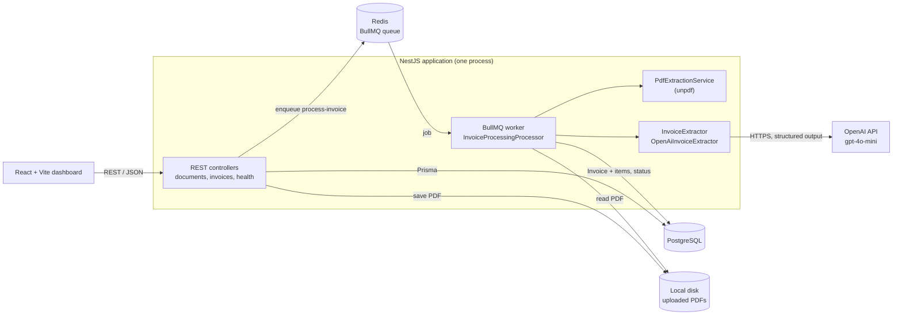
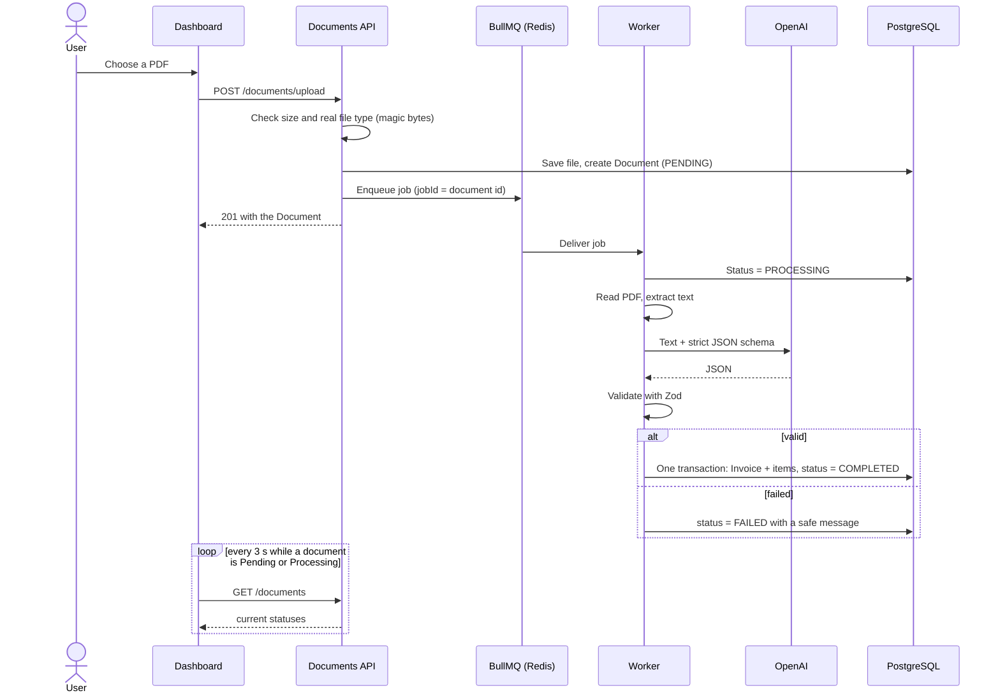
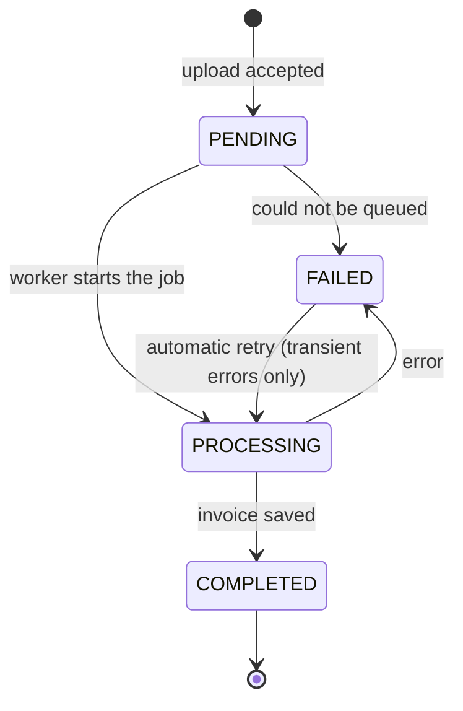
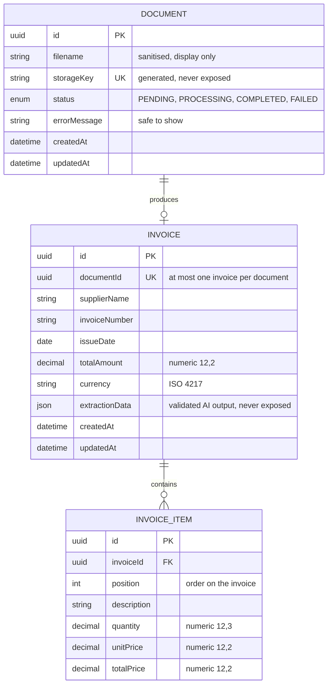

# Architecture

DocuMind AI is a **modular monolith**: one NestJS process serves the REST API *and* runs the background worker, backed by PostgreSQL and Redis. There are no microservices, no message broker beyond Redis, and no separate worker deployment.

## Request flow

Uploading returns immediately; extraction happens in the background and the dashboard polls for the result.

## Document lifecycle

## Data model

Money is stored as `numeric` and served as fixed-scale strings (`"1284.00"`), never as floating point.

## Backend modules

| Module | Responsibility |
|---|---|
| `documents` | Upload endpoint, validation, file naming, document queries, enqueueing |
| `storage` | The only code that touches the uploads directory; rejects any key that resolves outside it |
| `queues` | Queue and job names shared by producer and consumer |
| `processing` | The BullMQ worker: state changes, retries, duplicate handling, saving the invoice |
| `pdf` | Text extraction from text-based PDFs, with size and page limits |
| `invoice-extraction` | The `InvoiceExtractor` interface, the Zod schema, and the OpenAI implementation |
| `invoices` | Read-only invoice API: pagination, filters, DTOs |
| `prisma` | Database client (driver adapter for `pg`) |
| `common`, `config` | Validation pipe, upload error filter, rate-limit settings, environment validation |

`app.setup.ts` holds everything `main.ts` configures on top of the modules (security headers, CORS, Swagger, shutdown hooks), so tests apply the identical setup.

## Failure handling

| What went wrong | Document ends as | Retried? |
|---|---|---|
| Not a PDF, or corrupt | `FAILED`, "could not be read as a valid PDF" | No |
| No extractable text (scanned/image PDF) | `FAILED`, "No extractable text was found…" | No |
| More than 50 pages | `FAILED` | No |
| OpenAI rejects the API key | `FAILED` | No |
| OpenAI timeout, rate limit, or server error | `FAILED` (then `PROCESSING` again on retry) | Yes, up to 3 attempts with 2 s exponential backoff |
| Model returns invalid JSON or data that fails the schema | `FAILED` | Yes |
| Database error while saving | `FAILED`, generic message | Yes |
| Job can't be queued (Redis down) | `FAILED`, upload responds 500 | No |

Only messages written for users (the PDF and extraction errors above) are stored on the document. Any other error, such as filesystem or database errors, is replaced by a generic message, and the detail goes to the server log only.

### Duplicate processing

The unique `documentId` on `Invoice` is the guarantee. On top of it:

- A job first checks whether an invoice already exists for the document, and if so finishes without calling the AI again.
- Enqueueing uses the document id as job id, so the same document can't be queued twice while a job is pending.
- If two workers race and one hits the unique constraint, the loser treats that as success.
- The invoice and all its items are written in one transaction, so a failed line item never leaves a half-saved invoice.

## Design decisions

- **Worker inside the API process.** Simplest thing that works for an MVP. The queue is real BullMQ, so the worker can be moved to its own process later without changing the pipeline.
- **`InvoiceExtractor` interface with one implementation.** Keeps the AI provider out of the business logic and lets every test fake it. There is deliberately no second provider.
- **Never trust model output.** The provider is asked for strict JSON-schema output, and the result is validated again with Zod, including bounds that match the database columns.
- **Text extraction only.** Text-based PDFs are read directly. There is no OCR, so scanned invoices fail with a clear message.
- **Polling, not websockets.** The dashboard refreshes every 3 seconds only while something is being processed.
- **Frontend state lives in the URL.** Search and page are query parameters, so going back from an invoice restores the list. There is no global state library.
- **Local file storage.** Uploaded PDFs go to a directory (a volume in production). See [Limitations](../README.md#limitations).
